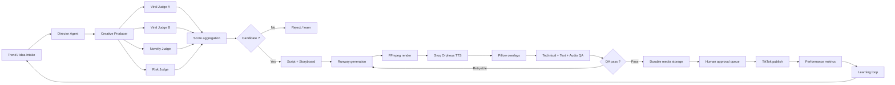
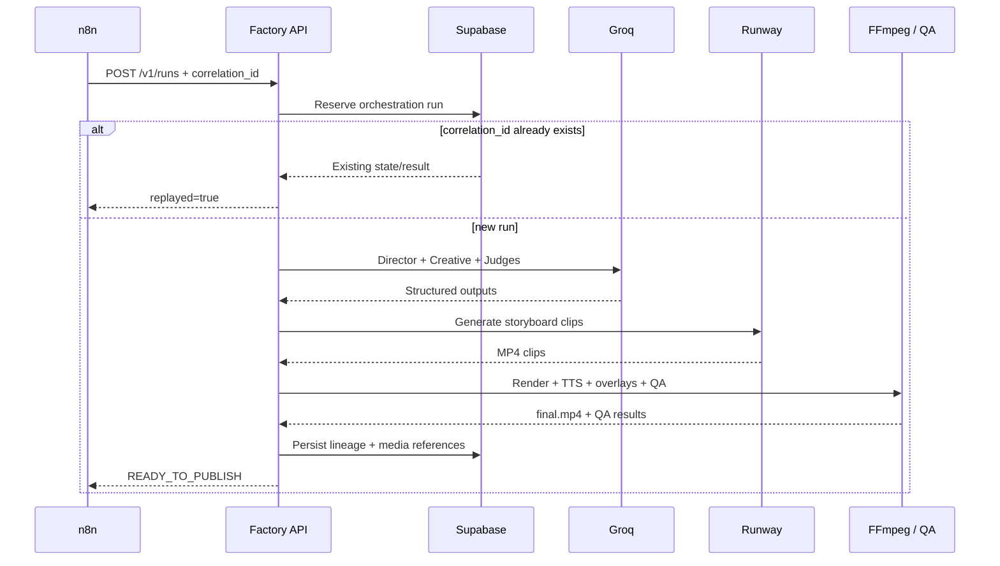

# TikTok AI Factory

> **Concevoir une usine de contenu TikTok pilotée par des agents IA, capable de transformer une idée en vidéo évaluée, montée, contrôlée et prête à publier — avec des coûts bornés, une traçabilité complète et une orchestration progressivement autonome.**


| | |
|---|---|
| **Rôle** | Conception produit, architecture, développement backend/IA, automatisation et validation end-to-end |
| **Objectif** | Industrialiser la création de vidéos TikTok tout en gardant les décisions critiques observables et contrôlables |
| **Stack** | Python · Pydantic · FastAPI · Groq · Runway · FFmpeg · Pillow · Supabase · n8n · Render |
| **État actuel** | API V4 déployée en Europe, n8n Cloud connecté, génération Runway + post-production V3.1 validées ; stockage durable V4.2 en cours |
| **Principe** | n8n orchestre ; le moteur Python conserve la logique métier |

---

## 1. Le problème

Produire une vidéo courte n'est pas difficile. Produire **régulièrement** des vidéos qui restent cohérentes, techniquement valides, peu coûteuses, traçables et améliorables l'est beaucoup plus.

Un système réellement exploitable doit répondre à plusieurs questions en même temps :

- quelle idée mérite d'être produite ?
- comment éviter qu'un seul modèle soit juge et partie ?
- combien coûtera la génération avant de lancer les appels payants ?
- comment transformer plusieurs clips IA en une vidéo verticale exploitable ?
- comment contrôler le texte, l'audio, le codec, la résolution et les artefacts ?
- comment empêcher un retry n8n ou un double-clic de générer deux fois la même vidéo ?
- comment conserver les médias après l'extinction d'un runner ou d'une instance cloud ?
- comment connecter demain publication et analytics sans déplacer la logique métier dans l'orchestrateur ?

**TikTok AI Factory traite donc la création de contenu comme un problème de système distribué et de pipeline de décision, pas comme un simple prompt vidéo.**

---

## 2. Vision cible



La cible finale est une boucle complète : **observer → décider → produire → contrôler → publier → mesurer → apprendre**.

---

## 3. Ce qui fonctionne aujourd'hui

| Version | Capacité | Validation |
|---|---|---|
| **V1** | State machine, retries bornés, budget ledger, renderer FFmpeg, QA technique | ✅ Tests automatisés |
| **V2** | Director + Creative Producer + 4 juges indépendants via Groq, sorties JSON strictes, persistance Supabase | ✅ Live validé |
| **V3** | Génération réelle de clips avec Runway Gen-4.5 + contrôle de budget avant appels | ✅ Live validé |
| **V3.1** | Voix Orpheus, overlays Pillow responsives, QA texte/audio/technique, rerender sans nouvel appel Runway | ✅ Live validé |
| **V4.0** | FastAPI authentifiée, idempotence par `correlation_id`, control plane n8n | ✅ CI + Docker smoke |
| **V4.1** | Déploiement Render Frankfurt + n8n Cloud → API | ✅ `MOCK_OK` end-to-end |
| **V4.2** | Persistance durable des MP4/WAV/PNG/JSON dans Supabase Storage | 🚧 En cours |

Le premier chemin réel Runway a produit une vidéo verticale H.264 **1080×1920 / 30 fps**. La V3.1 a ensuite ajouté une narration TTS, une typographie responsive et des contrôles média sans régénérer les clips Runway.

Le premier smoke test n8n Cloud → Render → Factory API répond désormais avec :

```json
{
  "status": "MOCK_OK",
  "video_provider": "synthetic",
  "estimated_generation_cost_usd": 0.0
}
```

Ce mode de contrôle est volontairement léger : aucun appel Groq, Runway, Supabase ou FFmpeg payant/lourd n'est lancé.

---

## 4. Architecture actuelle

```mermaid
flowchart TB
    subgraph Control[Control plane]
        N[n8n Cloud]
    end

    subgraph API[Factory API - Render Frankfurt]
        F[FastAPI]
        S[FactoryOrchestrationService]
        P[IntelligentPipeline]
        R[FactoryPipeline]
        Q[QA]
    end

    subgraph Providers[Providers]
        G[Groq LLM / Orpheus TTS]
        V[Runway Video]
        FF[FFmpeg + Pillow]
    end

    subgraph Data[Data plane]
        DB[(Supabase PostgreSQL)]
        ST[(Supabase Storage)]
    end

    N -->|Bearer Auth + correlation_id| F
    F --> S
    S --> P
    P --> G
    P --> R
    R --> V
    R --> FF
    R --> Q
    S --> DB
    S -. V4.2 .-> ST
```

### Responsabilités

| Composant | Responsabilité |
|---|---|
| **n8n Cloud** | Déclenchement, planning, futures files d'approbation et intégrations externes |
| **FastAPI** | Contrat HTTP authentifié et stable pour l'orchestrateur |
| **FactoryOrchestrationService** | Idempotence, réservation du run, exécution et résultat |
| **IntelligentPipeline** | Direction créative, script, storyboard, juges et score agrégé |
| **FactoryPipeline** | Génération média, rendu, retries, budget et transitions d'état |
| **Groq** | LLM structurés + Orpheus TTS |
| **Runway** | Génération vidéo réelle |
| **FFmpeg / Pillow** | Rendu final, audio, normalisation et overlays texte |
| **Supabase PostgreSQL** | Généalogie du contenu, runs, jobs, QA, publications et métriques |
| **Supabase Storage** | Stockage durable des médias — V4.2 |

Le choix structurant est volontaire : **n8n ne contient pas la logique métier**. Si l'orchestrateur change demain, le moteur reste portable.

---

## 5. Cycle d'un run live



L'idempotence est une contrainte de sécurité économique : **un retry réseau ne doit jamais devenir un deuxième appel vidéo payant**.

---

## 6. Principes de conception

### Multi-juges plutôt qu'un score unique

Le Director et le Creative Producer ne décident pas seuls de la qualité de leur propre proposition. Plusieurs juges indépendants évaluent viralité, nouveauté et risque, puis leurs sorties sont agrégées.

> Le score viral est un **outil de tri expérimental**, jamais une garantie de performance réelle.

### Budget avant génération

Chaque tentative estime son coût avant le premier appel vidéo. Une `BudgetPolicy` peut bloquer un run avant qu'il ne dépense.

### Idempotence partout où l'argent est engagé

Un `correlation_id` stable sert de clé d'orchestration. Les identifiants de la généalogie sont déterministes et les replays convergent vers le même run.

### QA comme étape métier, pas comme post-scriptum

Une vidéo n'est pas prête parce que FFmpeg a terminé. Le pipeline vérifie notamment :

- présence et intégrité du fichier ;
- codec H.264 ;
- résolution 1080×1920 ;
- 30 fps ;
- durée ;
- audio AAC lorsque requis ;
- cohérence audio/vidéo ;
- bornes et safe zones du texte ;
- taille de police et nombre de lignes.

### Séparation métadonnées / octets

Une `storage_key` en base n'est pas considérée comme une preuve que le fichier existe réellement. La V4.2 formalise cette séparation avec un backend physique Supabase Storage.

---

## 7. Stack technique

| Domaine | Technologies |
|---|---|
| Langage | Python 3.11+ |
| Modèles / validation | Pydantic |
| API | FastAPI + Uvicorn |
| LLM | Groq OpenAI-compatible API |
| TTS | Groq Orpheus |
| Vidéo IA | Runway Gen-4.5 |
| Post-production | FFmpeg + ffprobe + Pillow |
| Données | Supabase PostgreSQL |
| Stockage média | Supabase Storage |
| Orchestration | n8n Cloud |
| Hébergement API | Render — Frankfurt |
| Qualité | pytest · Ruff · mypy · GitHub Actions |

---

## 8. Structure du dépôt

```text
tiktok-ai-factory/
├── src/tiktok_factory/
│   ├── api/                 # FastAPI + orchestration service
│   ├── cli/                 # commandes locales et live validation
│   ├── domain/              # modèles et états métier
│   ├── pipeline/            # intelligent pipeline, renderer, rerender, policies
│   ├── providers/           # Groq, Runway, TTS, providers locaux
│   ├── qa/                  # technical / creative / text / audio reviews
│   ├── scoring/             # agrégation et décisions
│   └── storage/             # Supabase metadata + media backends
├── supabase/migrations/     # schéma PostgreSQL versionné
├── n8n/                     # workflows d'orchestration
├── tests/                   # unit, integration, e2e
├── docs/                    # runbooks et setup n8n/Render
├── .github/workflows/       # CI + validations live manuelles
├── ARCHITECTURE.md
├── PROJECT_STATUS.md
├── Dockerfile
├── render.yaml
└── README.md
```

---

## 9. Installation locale

### Prérequis

- Python 3.11+
- `ffmpeg`
- `ffprobe`

```bash
git clone https://github.com/Steve-Landry-NONO/tiktok-ai-factory.git
cd tiktok-ai-factory

python -m venv .venv
source .venv/bin/activate
pip install -e '.[dev]'
```

Sous Windows :

```powershell
.venv\Scripts\Activate.ps1
pip install -e '.[dev]'
```

### Smoke local gratuit

```bash
python -m tiktok_factory.cli intelligent-demo \
  --mode mock \
  --video-provider synthetic \
  --output output/mock
```

### QA et qualité du code

```bash
ruff check .
mypy
pytest -q
```

---

## 10. Modes d'exécution

### Mock / synthetic

Utilisé pour les tests et CI. Aucun fournisseur vidéo payant n'est requis.

### Live / synthetic

Utilise Groq pour la couche intelligente mais garde la génération vidéo synthétique.

### Live / Runway

```bash
python -m tiktok_factory.cli intelligent-demo \
  --mode live \
  --video-provider runway \
  --output output/runway_live \
  --idea "A futuristic city where gravity reverses every midnight"
```

Ce chemin exige des credentials serveur et déclenche des opérations potentiellement payantes.

### V3.1 — rerender sans nouvelle génération Runway

```bash
python -m tiktok_factory.cli rerender-existing \
  --input-dir output/downloaded-artifact \
  --metadata output/downloaded-artifact/metadata.json \
  --output output/rerender-v3.1
```

Le rerender produit voix, overlays, montage et QA à partir de clips existants. Il **n'appelle jamais Runway**.

---

## 11. API V4

### Health check

```http
GET /healthz
```

### Lancer un run

```http
POST /v1/runs
Authorization: Bearer <FACTORY_API_TOKEN>
Content-Type: application/json
```

```json
{
  "idea": "A futuristic city where gravity reverses for one minute",
  "correlation_id": "daily-2026-08-15-slot-1",
  "mode": "mock",
  "video_provider": "synthetic",
  "postprocess": false
}
```

Le service de référence est actuellement déployé sur Render en région **Frankfurt (EU Central)**.

---

## 12. Données et sécurité

Les secrets ne doivent jamais être versionnés.

Variables principales :

```text
FACTORY_API_TOKEN
GROQ_API_KEY
RUNWAY_API_KEY
SUPABASE_URL
SUPABASE_SECRET_KEY
```

Principes appliqués :

- credentials fournisseurs uniquement côté serveur ;
- Bearer Auth entre n8n et Factory API ;
- RLS activé sur les tables Supabase ;
- bucket média privé ;
- aucun secret dans les exports n8n ;
- erreurs sanitizées ;
- retries bornés uniquement sur les erreurs temporaires ;
- pas de retry aveugle n8n sur une opération payante.

---

## 13. Tests et validation

Le dépôt utilise plusieurs niveaux de validation :

1. **Unit tests** — modèles, scoring, policies, providers, orchestration, storage.
2. **Integration tests** — FFmpeg / ffprobe et chaîne média locale.
3. **Docker smoke** — démarrage réel de la Factory API et vérification auth.
4. **Mock control-plane smoke** — n8n/Render sans dépense fournisseur.
5. **Live validations manuelles** — Groq, Runway et V3.1 avec budget explicite.

Les workflows live restent volontairement manuels afin qu'un changement de code ne déclenche jamais de dépense IA automatiquement.

---

## 14. Ce que le projet m'a appris

### Une IA n'est pas nécessairement la bonne solution à chaque étape

Les tâches déterministes — validation de schéma, idempotence, budget, codec, dimensions, safe zones — restent du code classique. L'IA est réservée aux décisions où elle apporte réellement de la valeur.

### Le coût est une contrainte d'architecture

Un appel vidéo est une opération économique. Les retries, doublons et timeouts ne sont donc pas seulement des sujets techniques : ils ont un coût réel et doivent être modélisés.

### Un prototype vidéo n'est pas encore un système

Le passage important n'a pas été « générer un MP4 », mais rendre cette génération observable, testable, rejouable, persistante et orchestrable.

### Les retours réels dictent les versions

La V3.1 existe parce que la première vidéo V3 avait révélé deux défauts immédiatement visibles : absence de voix et texte hors cadre. La version suivante a donc traité ces problèmes au niveau du système plutôt que par retouche manuelle.

---

## 15. Limites actuelles

- La QA créative visuelle automatique n'est pas encore au niveau de la QA technique déterministe.
- La publication TikTok n'est pas encore connectée.
- L'approbation humaine n'est pas encore une file structurée dans n8n.
- Les performances TikTok réelles ne réinjectent pas encore automatiquement leurs signaux dans les décisions futures.
- Le stockage média durable est en cours d'intégration dans V4.2.
- L'exécution des longs runs doit encore évoluer vers un modèle asynchrone / worker avant forte volumétrie.

Ces limites sont explicites pour éviter de présenter un prototype comme une plateforme déjà autonome.

---

## 16. Roadmap


### Prochaines étapes

- [x] Génération vidéo IA réelle
- [x] TTS + post-production + QA média
- [x] API authentifiée et idempotente
- [x] n8n Cloud → Render → Factory API
- [x] Déploiement européen
- [ ] Persistance durable Supabase Storage
- [ ] Workers asynchrones / queue
- [ ] File d'approbation humaine
- [ ] TikTok Posting API
- [ ] Ingestion analytics TikTok
- [ ] Boucle d'apprentissage et optimisation multi-comptes

---

## 17. Direction produit

L'objectif long terme n'est pas de produire une seule page TikTok automatisée.

Le système est conçu comme une base expérimentale permettant progressivement de :

- gérer plusieurs comptes et niches ;
- mesurer les effets des hooks, concepts, durées, styles et heures de publication ;
- accumuler un historique exploitable de décisions créatives et de performances ;
- transformer cette connaissance en règles d'allocation de contenu ;
- réutiliser l'infrastructure pour d'autres plateformes sociales.

La valeur stratégique se situe donc autant dans **la donnée accumulée et la boucle d'apprentissage** que dans la génération des vidéos elle-même.

---

## 18. Documentation

- [`ARCHITECTURE.md`](ARCHITECTURE.md) — architecture et frontières métier
- [`PROJECT_STATUS.md`](PROJECT_STATUS.md) — état courant du projet
- [`docs/N8N_SETUP.md`](docs/N8N_SETUP.md) — orchestration n8n
- [`docs/RENDER_N8N_CLOUD.md`](docs/RENDER_N8N_CLOUD.md) — déploiement Render + n8n Cloud
- [`supabase/migrations/`](supabase/migrations/) — modèle persistant
- [`.github/workflows/`](.github/workflows/) — CI et validations live

---

## Auteur

**Steve Landry KOUOKAM NONO**  
Ingénierie Data & IA · automatisation · systèmes intelligents

[GitHub](https://github.com/Steve-Landry-NONO) · [LinkedIn](https://www.linkedin.com/in/steve-landry-kouokam-nono-18b175291/)

---

**Compétences démontrées :** architecture logicielle · agents IA · structured outputs · orchestration · API design · idempotence · génération vidéo IA · TTS · FFmpeg · QA média · cost control · Supabase · n8n · Docker · CI/CD · observabilité · documentation technique
